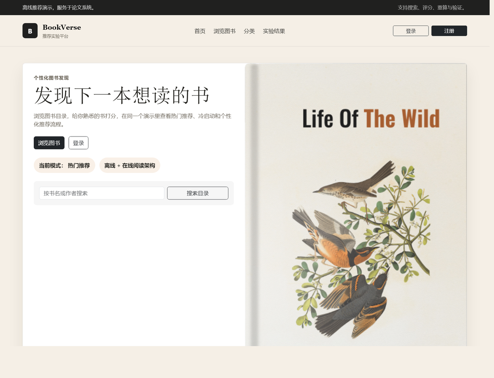
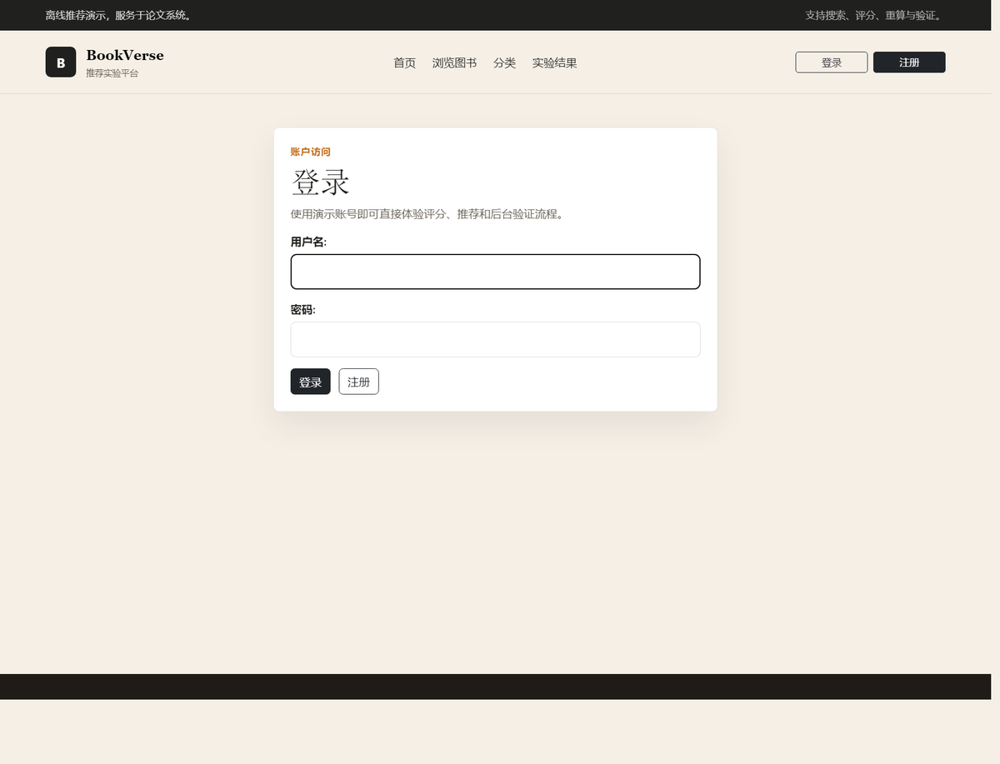
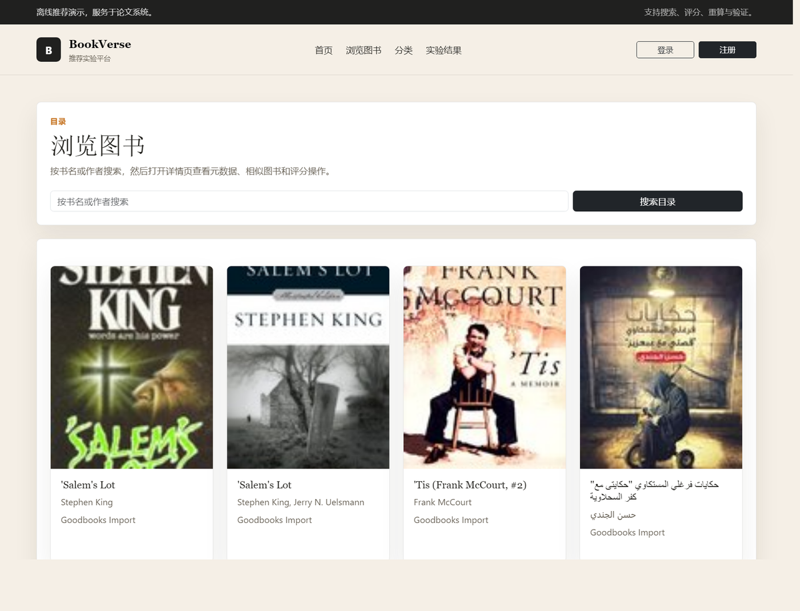
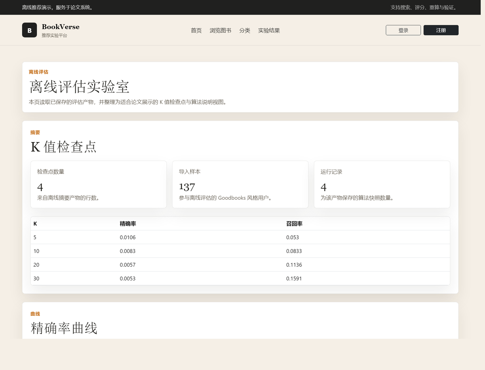

# 图书推荐系统 | Django Collaborative Filtering Demo

一个可直接在线展示的图书推荐系统。项目围绕论文/答辩场景设计，包含图书浏览、用户评分、个性化推荐、离线评估实验页和管理员运维入口。

线上演示地址：

https://web-production-7e7f.up.railway.app

演示账号：

| 角色 | 用户名 | 密码 | 用途 |
| --- | --- | --- | --- |
| 普通读者 | `demo_reader` | `DemoPass123!` | 浏览图书、评分、查看推荐结果 |
| 管理员 | `thesis_admin` | `AdminPass123!` | 查看管理页、触发推荐刷新、进入 Django Admin |

## 页面预览

### 首页

首页提供图书入口、实验结果入口和演示导览，适合给客户或答辩老师快速说明系统范围。



### 登录页

系统支持普通用户和管理员两类演示路径，登录页直接说明推荐、评分和后台验证流程。



### 图书列表页

图书列表页展示公开数据导入后的图书集合，便于说明系统不是空壳演示站。



### 实验结果页

实验页展示离线评估结果，包括 K 值检查点、精确率曲线、召回率曲线、相似度对比和随机交互划分。



## 核心能力

- 图书浏览：支持首页推荐、图书列表、分类入口和图书详情页。
- 用户评分：普通用户可以对图书打分，评分会进入推荐链路。
- 推荐中心：展示推荐书单、推荐分数和推荐理由。
- 真实数据接入：支持 Goodbooks-10k 风格公开数据导入，当前演示版本使用了有界样本。
- 离线评估：生成 `summary.json` 实验产物，并在网页中展示 precision、recall、K 值和算法对比。
- 管理后台：管理员可以查看离线任务状态，并手动触发推荐刷新。
- Railway 部署：客户只需要访问公网 URL，不需要配置 Python、MySQL 或 Redis。

## 技术栈

| 层级 | 技术 |
| --- | --- |
| Web 框架 | Django 5 |
| 数据库 | MySQL，演示模式可使用 SQLite |
| 缓存 | Redis，演示模式可使用本地内存缓存 |
| 推荐算法 | 热门推荐、ItemCF、UserCF、轻量混合策略 |
| 评估 | Precision、Recall、K 值检查点、随机交互划分 |
| 部署 | Railway + Gunicorn + WhiteNoise |

## 推荐演示流程

1. 打开线上首页：`https://web-production-7e7f.up.railway.app`
2. 使用 `demo_reader` / `DemoPass123!` 登录。
3. 打开个人中心，查看评分记录和推荐状态。
4. 打开推荐中心，查看推荐书目、推荐分数和推荐理由。
5. 打开实验结果页，展示离线评估指标。
6. 退出后切换到 `thesis_admin` / `AdminPass123!`。
7. 打开管理面板，查看最近离线任务并手动触发刷新。

更详细的线上点击说明见：

[ONLINE_DEMO_GUIDE.md](ONLINE_DEMO_GUIDE.md)

本地手动测试说明见：

[MANUAL_TEST_GUIDE.md](MANUAL_TEST_GUIDE.md)

## 本地运行

### 1. 准备环境

```powershell
conda run -n bookrec311 python -m pip install -r requirements.txt
```

复制环境变量模板：

```powershell
Copy-Item .env.example .env
```

根据本机情况填写 MySQL 和 Redis 参数。

### 2. 初始化数据库

```powershell
conda run -n bookrec311 python manage.py migrate
```

### 3. 导入公开数据并生成推荐

把 `books.csv` 和 `ratings.csv` 放到 `data/raw/goodbooks/` 后运行：

```powershell
conda run -n bookrec311 python manage.py import_goodbooks --source data/raw/goodbooks --limit-ratings 5000
conda run -n bookrec311 python manage.py rebuild_recommendations
conda run -n bookrec311 python manage.py evaluate_recommenders
```

如果没有公开数据文件，也可以初始化一套轻量演示数据：

```powershell
conda run -n bookrec311 python scripts/init_demo_data.py
```

### 4. 启动服务

```powershell
conda run -n bookrec311 python manage.py runserver
```

浏览器打开：

http://127.0.0.1:8000/

## 演示模式

如果只想本机点一遍功能，可以使用 MySQL 演示配置，缓存走本地内存，不依赖 Redis：

```powershell
conda run -n bookrec311 python manage.py migrate --settings=book_recommender.settings_mysql_demo
$env:DJANGO_SETTINGS_MODULE='book_recommender.settings_mysql_demo'
conda run -n bookrec311 python scripts/init_demo_data.py
conda run -n bookrec311 python manage.py evaluate_recommenders --settings=book_recommender.settings_mysql_demo
Remove-Item Env:DJANGO_SETTINGS_MODULE
conda run -n bookrec311 python manage.py runserver 127.0.0.1:8000 --settings=book_recommender.settings_mysql_demo
```

## 运维和部署说明

Railway Web 服务启动时会自动执行：

```bash
python manage.py collectstatic --noinput
python manage.py evaluate_recommenders --skip-record
gunicorn book_recommender.wsgi:application --bind 0.0.0.0:$PORT
```

这样每次部署后都会刷新实验页需要的 `artifacts/evaluations/summary.json`，不会因为容器重建而出现空实验页。

## 验证命令

```powershell
conda run -n bookrec311 python manage.py check
conda run -n bookrec311 pytest tests/test_end_to_end_smoke.py -q
conda run -n bookrec311 pytest tests/test_evaluations.py tests/test_railway_settings.py -q
```

最近一次关键验证：

- 中文化核心验收：`61 passed`
- 评估产物部署修复测试：`11 passed`
- Railway 线上实验页：已显示非空 K 值、precision、recall 和随机划分指标

## 项目结构

```text
apps/
  accounts/          登录、注册、个人中心
  catalog/           首页、图书列表、详情页、分类页
  ratings/           用户评分流程
  recommendations/   推荐生成、缓存和管理命令
  evaluations/       离线评估、实验结果页
  dashboard/         管理员运维面板
book_recommender/    Django 项目配置、基础模板、静态资源
docs/assets/readme/  README 页面截图
scripts/             初始化、下载、验证和计划任务脚本
tests/               单元测试、端到端 smoke、部署配置测试
```

## 当前状态

- 线上版本已部署到 Railway。
- 页面已切换为中文界面。
- Goodbooks 风格公开交互数据已接入演示环境。
- 实验页已从占位数据改为真实评估指标输出。
- 推荐解释已出现在推荐中心、详情页和个人中心相关路径中。
